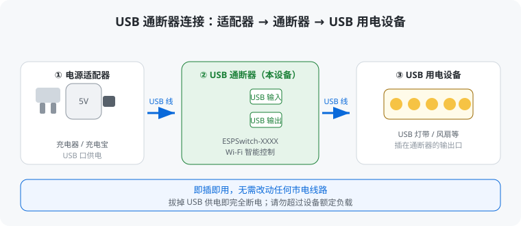
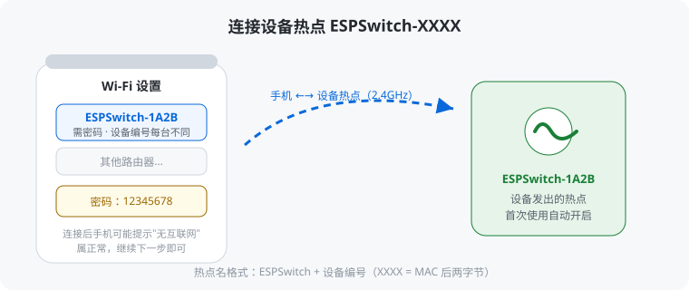
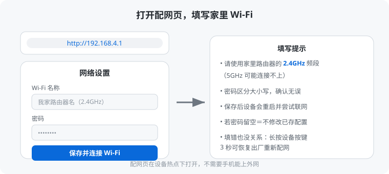
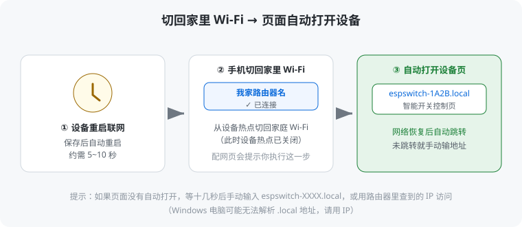
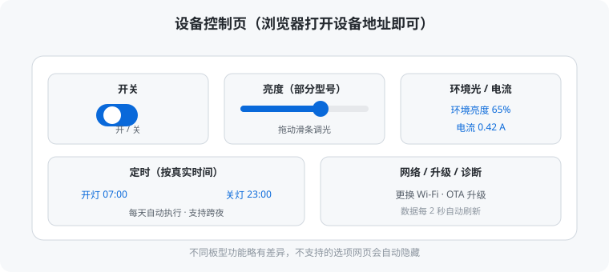
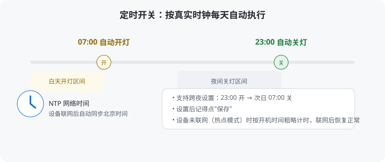
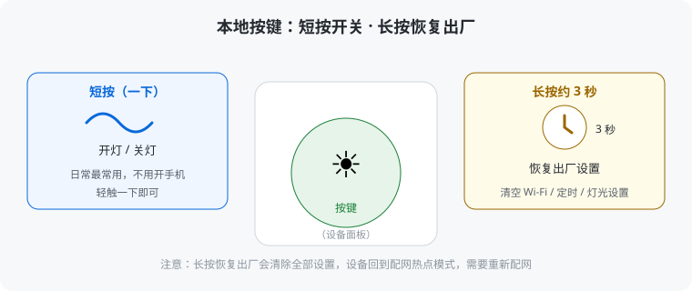
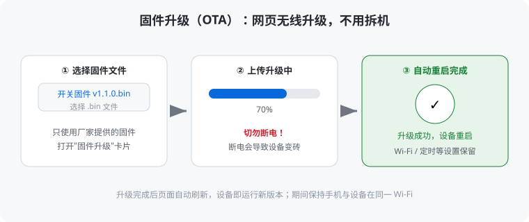

# ESP-Switch 智能开关 · 用户使用说明

感谢使用 ESP-Switch 智能开关。本说明面向普通用户，用通俗语言介绍设备的安装、配网、日常使用与常见问题。

---

## 1. 认识你的设备

ESP-Switch 是一个 **USB 通断器**，串联在 USB 供电回路中，控制 USB 设备的通电/断电，支持：

- **手机/电脑网页控制**：开关、调节亮度（支持的板型）、查看环境亮度、实时电流
- **定时开关**：设置每天的开/关时间，自动执行
- **本地按键控制**：不用手机也能按一下开关
- **无线升级**：新功能通过网页直接升级，不用重新接线

> 不同型号（板型）功能略有差异，例如部分型号不带亮度调节或电流检测，网页上会自动隐藏不支持的选项。

---

## 2. 快速开始（首次使用）

### 2.1 连接设备

1. 用 USB 线把**电源适配器（充电器/充电宝）**接到设备的 **USB 输入口**。
2. 把要控制的设备（如 **USB 灯带、风扇** 等）插入设备的 **USB 输出口**。
3. 给适配器通电，设备自动启动（约几秒）。

> 即插即用，**无需改动任何市电线路**；拔掉 USB 供电即完全断电。

### 2.2 连接设备热点

首次使用（未配置过 WiFi）时，设备会发出一个自己的无线热点：

1. 打开手机的 Wi-Fi 列表，找到名为 **`ESPSwitch-XXXX`** 的热点（XXXX 是设备编号，每台设备不同）。
2. 连接它，密码是 **`12345678`**。

### 2.3 打开配网页面

1. 手机浏览器（Safari / Chrome 等）输入地址：**`http://192.168.4.1`**
2. 页面打开后，在「网络」区域填写你家路由器的 **Wi-Fi 名称** 和 **密码**（请使用 **2.4GHz** 频段）。
3. 点击「**保存并连接 Wi-Fi**」。

### 2.4 切回家里 Wi-Fi

1. 按页面提示，把手机**切回家里原来的 Wi-Fi**。
2. 页面会自动打开设备控制页（一般等几秒，设备正在重启并联网）。
3. 如果页面没有自动跳转，手动在浏览器输入：**`http://espswitch-XXXX.local`**（XXXX 与热点名一致）。

> 配网成功后，以后每次开机设备都会自动连接家里 Wi-Fi，无需再次配网。

---

## 3. 日常控制

设备联网后，在同一 Wi-Fi 下的手机/电脑浏览器打开设备地址（见第 5 节），即可进入控制页：

| 功能 | 说明 |
|---|---|
| **开关** | 点击按钮开灯/关灯 |
| **亮度** | 拖动滑条调节亮度（仅支持的板型） |
| **环境亮度** | 实时显示当前环境明暗（仅支持的板型） |
| **电流** | 实时显示灯具工作电流（仅支持的板型） |
| **定时** | 设置每天自动开灯/关灯的时间 |

页面数据每 2 秒自动刷新。

---

## 4. 定时功能

- 设备联网后会自动同步网络时间（北京时间），定时按**真实时钟**每天精确执行。
- 例如设置「07:00 开、23:00 关」，设备会在每天 07:00 自动开灯、23:00 自动关灯。
- 支持跨夜设置（如 23:00 开、次日 07:00 关）。
- **注意**：定时依赖网络时间。若设备处于热点模式（未联网），时间无法同步，定时只能按开机时间粗略运行，联网后自动恢复正常。

---

## 5. 局域网访问地址

设备连接家里 Wi-Fi 后，以下任一方式都能打开控制页：

1. **最方便**：浏览器输入 **`http://espswitch-XXXX.local`**（XXXX 是设备编号）。
   - 手机（iPhone/Android）和 Mac 都支持；Windows 电脑可能无法解析该地址，请用下面方式。
2. **查 IP 访问**：登录路由器管理页面，在「已连接设备 / DHCP 客户端」列表中找到本设备（名称含 `espswitch`），用显示的 IP 访问，例如 `http://192.168.1.23`。
3. 连接设备热点时（配网/应急），固定用 `http://192.168.4.1`。

> 建议在路由器中按设备 MAC 设置「固定 IP / DHCP 绑定」，这样 IP 不会变，以后访问更稳定。

---

## 6. 更换 WiFi / 忘记密码

需要把设备换到另一个 WiFi（例如搬家、换路由器）时：

**方式一（网页）**：打开设备控制页 →「网络」卡片 → 点击「**忘记 Wi-Fi，恢复热点模式**」，设备重启为热点，然后按第 2 节重新配网。

**方式二（按键）**：**长按设备按键约 3 秒**，设备恢复出厂（清空 WiFi、定时、灯光等所有设置）并重启为热点，然后按第 2 节重新配网。

> 方式二会清空所有设置，仅在使用方式一不方便时使用。

---

## 7. 本地按键

设备面板上的物理按键：

- **短按**：开/关灯。
- **长按约 3 秒**：恢复出厂设置（清空一切设置，回到配网热点模式）。

---

## 8. 固件升级（OTA）

设备支持网页无线升级，无需拆机：

1. 打开设备控制页 →「固件升级」卡片。
2. 选择厂家提供的固件文件（`.bin`）→ 点击升级。
3. 升级期间**切勿断电**，完成后设备自动重启，原有设置（Wi-Fi、定时）会保留。

> 请只使用厂家提供的固件。自行刷入不兼容固件可能导致设备无法工作。

---

## 9. 常见问题（FAQ）

**Q：手机找不到 `ESPSwitch-XXXX` 热点？**
A：确认设备已通电并等待启动完成（约 10 秒）；若设备之前配过网，它会优先连接家里的 Wi-Fi 而不开热点。如需重新配网，按第 6 节恢复热点模式。

**Q：连上热点但打不开 `192.168.4.1`？**
A：确认输入的是 `http://192.168.4.1`（不是 https，不是 www）；可尝试换一个浏览器；仍不行可尝试忽略该热点后重新连接。

**Q：配网后网页没有自动跳转？**
A：手动输入 `http://espswitch-XXXX.local`；若打不开，多半是设备还没完成联网，等十几秒刷新一下，或按第 5 节用 IP 访问。

**Q：定时不按设定时间执行？**
A：确认设备已连接家里 Wi-Fi（联网后才同步真实时间）；确认设置后已点击保存。

**Q：网页显示"连接失败"？**
A：设备可能掉线或 IP 变了，按第 5 节重新确认地址；若设备断电重启过，也可能需要刷新页面。

**Q：灯闪或嗡嗡响（亮度调节时）？**
A：部分 USB 灯带在中间亮度下会抖动/蜂鸣，请把亮度调到 100% 或最低档使用，或咨询厂家是否适合调光。

**Q：电流/环境亮度显示不准？**
A：这些数值是估算显示，用于参考。若偏差明显，请联系厂家校准。

---

## 10. 安全与注意事项

### 供电与负载

- 使用**合格的正规电源适配器**（建议 5V/1A 及以上，具体视所接设备功率而定），避免使用劣质/老化电源。
- **请勿超过设备额定负载**（额定电流/功率见产品标签）；超载可能损坏设备、适配器或所接设备，严重时可能引发危险。
- 仅连接 **USB 供电设备**（如灯带、风扇、小夜灯等）；大功率设备（如电动工具、加热器）请勿接入。
- 接入的设备总功耗应在通断器额定范围内，不要通过它串联多个大功率设备。

### 使用环境

- 保持设备干燥、通风，**远离水源**，避免在潮湿、高温、阳光直射或灰尘大的环境使用。
- 请勿在易燃、易爆环境中使用本设备。
- 长期不用时，建议拔掉 USB 供电。

### 日常操作

- 连接、拔插或更换用电设备时，**建议先拔掉 USB 供电**，再操作。
- 定期检查 USB 线和接口：发现破损、氧化、接触不良，请及时更换线材或联系厂家。
- 若设备在使用中**异常发热、冒烟或有异味**，请立即断电并停止使用。

### 网络与数据

- 设备网页控制接口**无密码保护**，仅建议在**家庭可信局域网**内使用；不要将设备直接暴露在公网。
- 固件升级请使用厂家提供的固件文件，升级期间切勿断电。

### 其他

- 长按按键约 3 秒会**恢复出厂设置**（清空 Wi-Fi、定时、灯光等全部设置），请谨慎操作。
- 请勿自行拆解、改装设备；如需维修请联系厂家。
